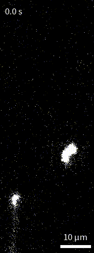

# mp4_video_generation
While it is easy to save images in python into png or tiff, it is more difficult to save an image stack into a video format. Especially if you need to compress it as so often is required for scientific publication (usually with a maximum size limit of 5-20 MB). This package makes it easy to save image stacks in numpy arrays into mp4-files. Multiple features are included: timestamp, scale bar, text on the video, and adding several image stacks in parallel into a video.

## Installation
### Dependencies:
You need to install the following libraries to run this package:
```shell
- pip install numpy >= 1.19, < 2
- pip install matplotlib >= 3.5.2, < 4
- pip install pillow > 9.2.0, < 10
- pip install scikit-image > 0.19.2, < 1
- pip install scikit-video > 1.1.11, < 2
- pip install tifffile > 2021.7.2
```
### Install this package
Find this package on [test.pypi.org](https://test.pypi.org/project/mp4-video-generation)
```shell
pip install -i https://test.pypi.org/simple/ mp4-video-generation
```
## Generation of a mp4 movie

### Input (raw) video:


```python
import mp4_video_generation.tiff_image_manipulation as ti
import mp4_video_generation.video_handling as vid

#Set video file path
file_path = r'C:\Users\example_video\DNA_moving.tif'

#Read tif file
img = ti.read_tif_file(file_path, frame_range=[0,0], print_read=True)
frame_range = [0,0] # if set to [0,0], all available frames will be used

settings = {
    # Basic settings
    'file_path_save' : 'example_video\DNA_moving_output.mp4', #path to save the video
    'frame_rate': 30.82, #frame rate of the video [frames per second]
    'playback_rate':30.82, #playback rate of the video [frames per second]. If set to -1, the playback rate will be the same as the frame rate 
    'frame_range':frame_range, #frame range for the video, if set to [0,0], all available frames will be used
    # Video Quality
    'crf':10, #crf used to save the video
    'preset':'slow', #preset used to save the video

    # Contrast settings
    'enhance_contrast':True, #enhance contrast of the video

    # General text settings
    'text_color':'white', #color of the text

    #Scale bar
    'd_scalebar':{ #dictionary of scale bar to add to the video
        'mag':'100x', #magnification of the microscope used to acquire the video
        'camera_pixel_width':16, #camera pixel width in microns
    }, 

    #Timestamp
    'd_timestamp':{
        'nbr_of_decimals_for_timestamp':1, #number of decimals for the timestamp
    }

}
vid.save_as_mp4(img, settings)
```

### Output video:


## Extensive settings list
It is possible to modify the output movie in numerable ways. The settings dictionary below show all the possible options. See below for comments on each option.
```python
settings = {}
```

### Adding a scale bar
It is fully possible and recommendable to add a scale bar to your video. It is important to specify the magnification the video was acquired with as well as the camera pixel width. Without these, the scale will be incorrect. To customize the padding of the scale bar to the video border, to the text, the fontsize of the text, specify this in the dictionary 'd_scalebar' as shown below:
```python
    #Scale bar
    'd_scalebar':{ #dictionary of scale bar to add to the video
        'pad_y':0, #y padding of the scale bar to the image border
        'pad_x':0, #x padding of the scale bar to the image border
        'width_um':1, #width of the scale bar in microns
        'width_factor':1, #width of the scale bar in pixels
        'fontsize':19, #font size of the scale bar
        'pad_text':0, #padding of the text to the scale bar
        'mag':'100x', #magnification of the microscope used to acquire the video
        'camera_pixel_width':16, #camera pixel width in microns
    }, 

```
### Adding a timestamp
To give the viewer a sense of the passing time of the contents of the video, you can add a timestamp. By default, this timestamp is placed in the upper left corner of the video. If the video is in slow-motion, make sure to increase the number of decimals with the setting 'nbr_of_decimals_for_timestamp'.
```python
    #Timestamp
    'd_timestamp':{ #dictionary of timestamp to add to the video
        'pad_timestamp_y':10, #y padding of the timestamp to the image border
        'font_size':19, #font size of the timestamp
        'text_y_pos':0, #y position of the timestamp
    'nbr_of_decimals_for_timestamp':1, #number of decimals for the timestamp
    }, 
```
 
### Modifying the text
Depending on what options you set, there will be various texts in the video. Make sure to set a text color which leads to great contrast, i.e. black text on a bright background or white text on a darker background. As the dimensions (x and y) of the videos might differ, you might have to change the font size accordingly so that it is easy to read the text. Also, if the text is positioned at a bad location, change the x coordinated using 'text_x_pos':
```python
    'text_color':'white', #color of the text
    'font_size':19, #font size of the text
    'text_x_pos':80, #x position of the text
```

### Modifying the playback rate
You might have recorded your videos at a high frame rate. However, you want to play the video much slower than real-time. Then you could adjust the playback rate:
```python
    'frame_rate': 30.82, #frame rate of the video
    'playback_rate':10, #playback rate of the video. If set to -1, the playback rate will be the same as the frame rate 
```
Make sure to also set the correct frame rate that the video was recorded with. It is stored in the metadata of the video.


Notice that the video is slowed down by decreasing the playback_rate from 30.8 to 10 fps.

### Adding a title
Sometimes, it can be great to add a title or other text to highlight features in the video. It can also be useful to add a background box (e.g. in black) to surround the title so it becomes more visible.
```python
    'd_title_text_box':{ #dictionary of title text box to add to the video
        'h_box':40, #height of the black box
        'w_box':'full', #width of the black box        
        'box_color':'black', #color of the box
        'padding_h':0, #horizontal padding of the text to the box
        'text':r'Single T4-DNA strands', #text to add to the video
        'text_color':'white', #color of the text
        'font_size':19, #font size of the text
        'text_y_pos ':100, #y position of the text
    }, 
```


### Adding descriptional text
To make it easier to understand what is going on in the video, you can add text. It can be for example, experiment parameters such as sample information,  pressure levels and magnification used. To not remove overshade the video, there is an option to increase the dimensions by adding a "black box" at the bottom of the video (set 'text_in_box_below' to True). 
```python
     #Extra text
    'd_extra_text':{ #dictionary of extra text to add to the video
        'text':'50 mbar, T4 DNA', #text to add to the video
        'text_x_pos':10, #x position of the text
        'h_box':70, #height of the black box
        'box_color':'black', #color of the box
        'text_in_box_below':False, #is the text in the box below or above the box?
        'font_size':19, #font size of the text
        'text_in_box_below':True,
    }, 
```


### Adding varying pressure value text
If one is performing an experiment with a pressure control system and the pressure varies over time, it can be useful to present the given pressure for each timestamp. For this, you need to have a numpy array with pressures that correspond to a numpy array with the frame numbers. To achieve this, you need to know the timestamp of the first frame to couple it with the timestamp of the pressures values.
```python
    #Pressure text
    'add_pressure_vector':False, #add pressure vector to the video
    #Pressure text
    'd_pressure':{ #dictionary of pressure values
        'p':np.arange(0,img.shape[0])*10, #pressure vector
        't_pix':np.arange(0,img.shape[0]), #time vector
        'text_x_pos':10, #x position of the text
        'text_y_pos':65, #y position of the text
        'font_size':19, #font size of the text
    }, 
```


### Modifying the contrast and brightness
Because the default brightness and contrast settings might be sub-optimal, you can change them. Either using hard pixel value limits (lims, 2 values). Everything below the first value will be black and everything above the second value will be white. Linear scaling in-between. For this you need to know the pixel value limits. An easier way is to use the lower and upper percintiles of all pixel values of each video. With the percentiles, a decent brightness and contrast setting is faster obtained. However, to compare videos quantatively, you need to set the same brightness and contrast using the hard pixel value limits.

```python
    # Contrast settings
    'enhance_contrast':True, #enhance contrast of the video
    'd_contrast':{ #dictionary of contrast settings. Choose basing the contrast settings between percentiles and pixel values
        #'set_contrast_based_on_percentiles':True, #set contrast based on percentiles
        #'p':np.array([5,95]), #percentiles used to set the contrast
        'set_contrast_based_on_pixel_values':True, #set contrast based on pixel values
        'lims':np.array([190,255]), #pixel values used to set the contrast
    }, #dictionary of contrast settings
```


### RGB (color) video
This script will also work with color videos (8-bit RGB).


### Enlarging the video (if small)
If the ROI is very small, the video dimensions can be increased. Set 'enlarge_image' to True and specify the final dimensions in pixel values.
```python
    'enlarge_image':False, #enlarge image
    'final_size_2D':(500,500), #final size of the image in 2D
```

### Concatenating videos
It is simple to concatenate videos horizontally, vertically or sequentially (in time). For this, you need two images, and two settings dictionary:
```python
settings1 = {
    ... #fill the dictionary with the usual settings
    'return_img':True,#return the image with the text and scale bar added
}
img1 = vid.save_as_mp4(img, settings21)
settings2 = {
    ... #fill the dictionary with the usual settings
    'return_img':True,#return the image with the text and scale bar added
}
img2 = vid.save_as_mp4(img, settings2)
```
Note that the parameter 'return_img' is set to True. The function will then return the modified image as a numpy array (with scale bar and timestamp etc..) instead of creating a mp4-movie. 

Thereafter, use the function concatenate_img_stacks_from_np_arrays() to concatenate the two image stacks and create a concatenated mp4-video. If both merge_horizontally and merge_vertically are set to False, the concatenation will be sequential.

#### Horizontal Concatenation
```python
list_settings = [settings1, settings2]
list_imgs = [img1, img2]
kwargs = {
        'file_path_save' : os.path.join(base_path,'output_concat.mp4'), #path to save the video
        'playback_rate':15, 
        'crf':10, # The range of the CRF scale is 0–51, where 0 is lossless, 23 is the default, and 51 is worst quality possible.]
        'preset':'slow',
        'merge_horizontally':True,
        'merge_vertically':False,
        }
vid.concatenate_img_stacks_from_np_arrays(list_settings, 
                                                      list_imgs, 
                                                      **kwargs)
```


#### Sequential Concatenation
```python
list_settings = [settings1, settings2]
list_imgs = [img1, img2]
kwargs = {
        'file_path_save' : os.path.join(base_path,'output_concat.mp4'), #path to save the video
        'playback_rate':15, 
        'crf':10, # The range of the CRF scale is 0–51, where 0 is lossless, 23 is the default, and 51 is worst quality possible.]
        'preset':'slow',
        'merge_horizontally':False,
        'merge_vertically':False,
        }
vid.concatenate_img_stacks_from_np_arrays(list_settings, 
                                                      list_imgs, 
                                                      **kwargs)
```

## A note on the video quality and file size
We can manipulate the quality and thus the size of the output video. Sometimes you want ultra-high resolution and can bear large videos. Other times you need to compress the video as much as possible while still maintaining a decent quality. We can play with the following parameters:

- Resolution (imge dimensions in x and y). Try to minimize as much as possible by cropping the video.

- Frame rate. We can remove frames if the video was recorded with an excessive frame rate.
```python
    'frame_rate_final':20, #Set the final (lower) frame rate, remove frames to achieve the desired frame rate. If set to -1, no frames will be removed
```
- crf (int, optional): [Constant rate factor (CRF) which sets the quality of the output video. The range of the CRF scale is 0–51, where 0 is lossless, 23 is the default, and 51 is worst quality possible.]. Defaults to 10.
```python
    'crf':10, #default constant rate factor (CRF)
```
- preset  (str, optional): Speed to compression ratio. the slower the better compression, in princple, default is slow. Options:
    - ultrafast
    - superfast
    - veryfast
    - faster
    - fast
    - medium – default preset
    - slow
    - slower
    - veryslow 
```python
    'preset':'slow', #default preset
```
- codex (str, optional): [Codex for writing the video]. Defaults to 'libx264'. For lower quality output (and very small videos), select DIVX or mpeg4. I have always used libx264 as I received errors for other codices. However, this is something one can play with.]
```python
    'codex':'libx264', #default codex
```
Note that crf has to be above 10 and preset has to be slow or faster in order to play the video in powerpoint.
other options see [https://trac.ffmpeg.org/wiki/Encode/H.264](https://trac.ffmpeg.org/wiki/Encode/H.264)